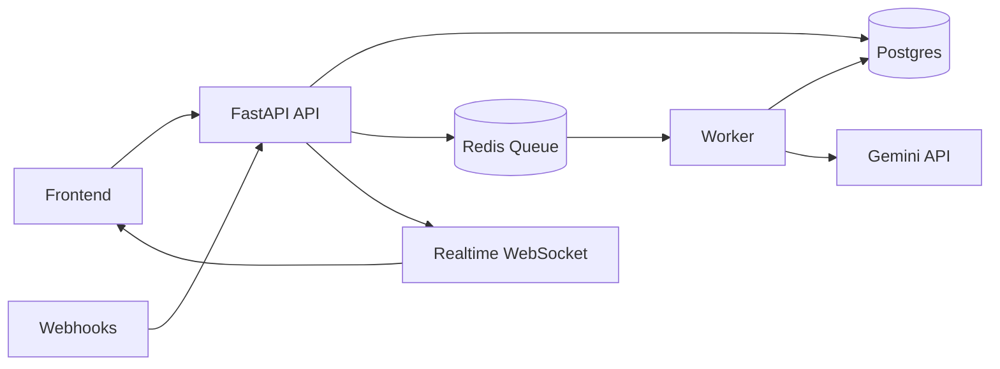
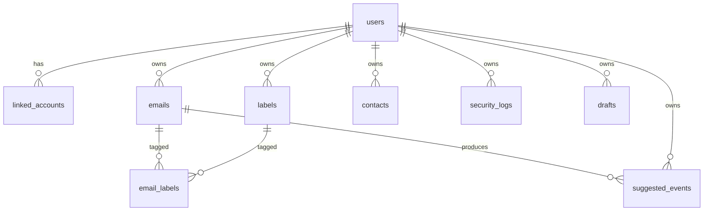

# UniSync

UniSync is a premium unified inbox for university students that merges Gmail and Outlook with AI-powered summaries, priority scoring, and security analysis.
It is designed for speed, clarity, and real-time updates with zero polling.

## Features
- Unified inbox across Gmail and Outlook
- Push-based ingestion (Gmail Pub/Sub, Microsoft Graph webhooks)
- AI summaries, priority scoring, phishing detection, smart categories
- Full-text search with Postgres tsvector
- Labels, snooze, archive, undo send, and rich compose
- Realtime updates via WebSocket gateway
- Calendar sync with suggested events

## Architecture

## ERD

## Quick Start
1. Copy `.env.example` to `.env` and fill in required values.
2. Run `docker-compose up`.
3. Apply migrations using your Postgres client (files in `backend/migrations`).
4. Visit the frontend at `http://<your-host>:5173`.

## Environment Setup
- Backend reads `.env` from the repo root.
- Frontend reads `VITE_*` variables.

## Deployment (Railway)
- Use `railway.json` and set env vars in Railway.
- Deploy services: `api`, `worker`, and `frontend`.

## API Reference
- Swagger UI available at `/docs` when the API is running.

## Contributing
- Run `npm run build` in `frontend` and ensure `python -m compileall app` passes in `backend`.
- Keep UI consistent with the design system in `frontend/src/styles`.
