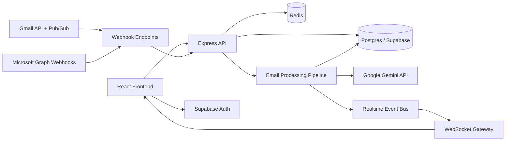

# UniSync

UniSync is an AI-powered unified inbox built for university students. It connects Gmail and Outlook into a single workspace, enriches incoming mail with summaries and risk analysis, suggests calendar events from messages, and updates the UI in real time without polling.

This project is positioned as a productivity and communication platform: part inbox client, part AI assistant, and part academic workflow organizer.

## Portfolio Summary

**One-line description**

UniSync is a full-stack web application that unifies Gmail and Outlook for students, then uses AI to summarize emails, prioritize urgent messages, flag phishing risk, and surface calendar actions in real time.

**What makes it strong for a portfolio**

- Solves a clear, real-world user problem: fragmented academic communication across multiple providers.
- Demonstrates end-to-end product thinking, not just isolated features.
- Combines frontend UX, async backend APIs, OAuth integrations, background jobs, AI enrichment, search, and realtime delivery.
- Uses production-style patterns: webhook ingestion, queue-based processing, encrypted tokens, RLS-ready Postgres schema, and provider-specific integrations.

**Resume-ready bullets**

- Built a full-stack unified inbox platform for students that aggregates Gmail and Outlook into a single real-time dashboard.
- Implemented a TypeScript + Express API, Redis-backed cache/realtime fan-out, and WebSocket updates to process and deliver email changes without polling.
- Integrated Google and Microsoft OAuth flows, webhook-based email ingestion, AI-generated summaries, priority scoring, phishing analysis, and calendar event extraction.
- Designed a React + TypeScript frontend with searchable inbox views, multi-account filtering, drafts, labels, and responsive mail-detail workflows.

## Product Overview

University students often manage communication across institutional Outlook accounts, personal Gmail inboxes, clubs, financial aid notices, internship threads, and class reminders. UniSync reduces that overhead by centralizing communication into one interface and automatically surfacing what matters most.

Core product goals:

- Unify multiple email providers in one inbox.
- Reduce reading time with AI-generated summaries.
- Help students focus using priority scoring and category classification.
- Improve safety with phishing and risk detection.
- Convert email content into action through suggested calendar events.
- Keep the UI live through push/webhook-driven updates instead of manual refreshes.

## Key Features

### Unified inbox

- Gmail and Outlook account linking via OAuth.
- Combined inbox across linked accounts.
- Account-specific and global inbox views.
- Sent, trash, unread, starred, high-risk, snoozed, and label-based filtering.

### AI enrichment pipeline

- Summary generation for email bodies.
- Priority classification with reason strings.
- Category classification into inbox buckets such as `primary`, `updates`, `promotions`, `social`, and `forums`.
- Phishing/risk analysis using deterministic checks plus Gemini-backed analysis when needed.

### Calendar intelligence

- Detects event-like content inside email bodies.
- Creates suggested events for the user to confirm or dismiss.
- Supports Google Calendar event creation from detected email content.

### Compose and drafting

- Rich HTML email sending.
- Reply and forward support.
- Draft creation, update, listing, and deletion.
- Attachment support with provider-specific send logic.

### Realtime experience

- WebSocket connection from the frontend to the backend.
- Background processing notifications trigger live inbox refreshes.
- Designed to avoid polling-heavy inbox behavior.

### Organization and productivity

- Labels and label assignment.
- Snooze support.
- Archive and delete flows.
- Thread view support.
- Full-text search over indexed email metadata.
- Keyboard shortcuts and command-style search UI.

## Architecture



## How It Works

### 1. Authentication and account linking

- The frontend uses Supabase Auth for user authentication.
- Users can link Gmail or Outlook accounts from the application.
- The backend creates and validates OAuth state records, exchanges provider auth codes for tokens, encrypts tokens before storage, and persists linked account metadata.

### 2. Email ingestion

- Gmail can be watched via Google Pub/Sub-backed inbox notifications.
- Outlook uses Microsoft Graph subscriptions and webhook notifications.
- Manual account sync is also supported through `/sync/account/{account_id}`.
- Raw provider messages are fetched, parsed, normalized, stored in Postgres, and handed to the enrichment pipeline.

### 3. AI processing pipeline

The backend processes each stored email through the enrichment pipeline:

- sets processing status
- performs deterministic risk checks
- runs Gemini-powered summary, priority, category, phishing, and event extraction tasks
- stores enrichment results
- creates suggested calendar events when relevant
- publishes a realtime event so the UI refreshes automatically

### 4. Frontend delivery

- The React dashboard loads accounts, labels, inbox pages, email details, and drafts with React Query.
- A WebSocket connection invalidates relevant queries when processing finishes.
- Users see updated summaries, risk badges, and event suggestions as enrichment completes.

## Tech Stack

### Frontend

- React 18
- TypeScript
- Vite
- React Router
- TanStack React Query
- Zustand
- Tailwind CSS + custom design tokens
- Framer Motion
- Storybook

### Backend

- Node.js 20
- TypeScript
- Express
- ws
- pg
- Supabase REST
- Redis
- ioredis

### AI and integrations

- Google Gemini API for summaries, prioritization, classification, phishing analysis, and event extraction
- Google Gmail API
- Google Calendar API
- Google Pub/Sub inbox watch flow
- Microsoft Graph API for Outlook mail and subscriptions
- Supabase Auth and Postgres

## Database Design

The initial schema in [backend/migrations/001_init.sql](/C:/Users/ARIN/OneDrive/Desktop/uniync/backend/migrations/001_init.sql) defines the main entities:

- `users`
- `linked_accounts`
- `oauth_states`
- `emails`
- `labels`
- `email_labels`
- `suggested_events`
- `contacts`
- `security_logs`
- `drafts`

Notable schema choices:

- enum types for `processing_status`, `risk_level`, `priority_level`, and `email_category`
- `tsvector` search index for full-text search
- `UNIQUE(account_id, message_id)` to avoid duplicate provider imports
- token storage separated into encrypted columns
- body expiration metadata for privacy-conscious retention behavior

## API Surface

Main API groups exposed by the active backend in [backend2/src](/C:/Users/ARIN/OneDrive/Desktop/uniync/backend2/src):

- `/auth` for OAuth linking and linked account management
- `/emails` for inbox listing, detail retrieval, state updates, snooze, delete, and thread views
- `/compose` for send, reply, forward, and draft management
- `/search` for inbox search
- `/labels` for label CRUD and email tagging
- `/calendar` for suggested-event confirmation and dismissal
- `/sync` for manual provider sync
- `/webhooks` for Gmail and Outlook event ingestion
- `/ws` for realtime updates
- `/health` and `/ready` for service checks

## Frontend UX Highlights

The frontend in [frontend/src](/C:/Users/ARIN/OneDrive/Desktop/uniync/frontend/src) is organized around a modern mail client workflow:

- dashboard layout with sidebar, top bar, message list, and detail pane
- multi-account switching
- inbox filters and category views
- infinite scrolling email list
- detail view with AI summary and suggested event actions
- command palette style search
- compose modal for sending and drafting mail
- responsive behavior for smaller screens

## Project Structure

```text
uniync/
|-- backend/                # Legacy Python implementation, migrations, and utility scripts kept for reference
|   |-- migrations/         # SQL schema and policies still used by the project
|-- backend2/
|   |-- src/
|   |   |-- routes/         # API route groups
|   |   |-- services/       # Gmail, Outlook, Gemini, calendar, security helpers
|   |   |-- workers/        # Email enrichment logic
|   |   |-- server.ts       # Express + WebSocket entrypoint
|-- frontend/
|   |-- src/
|   |   |-- components/     # Mail UI, layout, primitives, compose, search
|   |   |-- pages/          # Auth, dashboard, settings
|   |   |-- stores/         # Zustand state
|   |   |-- lib/            # API and Supabase helpers
|-- docs/                   # Product, design, and implementation notes
|-- docker-compose.yml
|-- railway.json
|-- .env.example
```

## Local Development

### Prerequisites

- Node.js 20+
- Docker (optional, for local infra)
- PostgreSQL 15
- Redis 7
- Supabase project
- Google Cloud credentials for Gmail/Calendar flows
- Microsoft Entra app credentials for Outlook flows
- Gemini API key

### Environment variables

Copy [.env.example](/C:/Users/ARIN/OneDrive/Desktop/uniync/.env.example) to `.env` and populate:

- Supabase URL, anon key, service role key, and JWT secret
- Postgres connection string
- Google OAuth, Pub/Sub, and redirect values
- Microsoft OAuth app values
- Gemini API key
- Redis URL
- encryption and JWT secrets
- frontend/API base URLs
- `VITE_*` frontend runtime variables

### Option A: run with Docker Compose

```bash
docker-compose up --build
```

Services exposed by the repo:

- frontend: `http://localhost:5173`
- API: `http://localhost:8000`
- Postgres: `localhost:5432`
- Redis: `localhost:6379`

### Option B: run services manually

Backend:

```bash
cd backend2
npm install
npm run dev
```

Frontend:

```bash
cd frontend
npm install
npm run dev
```

### Database setup

Apply the SQL files in [backend/migrations](/C:/Users/ARIN/OneDrive/Desktop/uniync/backend/migrations) against your Postgres/Supabase database.

At minimum, run:

1. `001_init.sql`
2. `002_rls_policies.sql`
3. `004_cron_jobs.sql`

## Deployment Notes

This repository is prepared for cloud-style deployment:

- `docker-compose.yml` supports local orchestration
- `backend2/Dockerfile` packages the active Node.js API runtime
- `railway.json` suggests Railway-based deployment support
- the config is structured around frontend, API, Postgres, and Redis services

## Security Considerations

The codebase already includes several security-conscious decisions:

- encrypted provider access and refresh tokens
- webhook signature verification
- OAuth state persistence and expiration
- JWT-based user identity extraction
- rate limiting on sensitive/auth-heavy endpoints
- row-level-security-oriented schema and policies
- short-lived raw email body retention metadata

## Engineering Highlights

This project demonstrates:

- full-stack product development
- multi-provider API integration
- TypeScript backend design
- background job orchestration
- AI feature integration inside a user-facing workflow
- realtime UI synchronization
- schema and indexing design for searchable messaging data
- portfolio-quality domain modeling around communication workflows

## Limitations / Current State

Based on the repository as it stands:

- automated test coverage is not yet a major part of the repo
- local setup depends on several third-party credentials
- Gmail/Outlook production readiness depends on correct provider app configuration and webhook setup
- some features documented in product docs may still be iterative or in progress

## Best Files To Review

If someone wants to understand the project quickly, start with:

- [frontend/src/pages/Dashboard.tsx](/C:/Users/ARIN/OneDrive/Desktop/uniync/frontend/src/pages/Dashboard.tsx)
- [backend2/src/server.ts](/C:/Users/ARIN/OneDrive/Desktop/uniync/backend2/src/server.ts)
- [backend2/src/routes/auth.ts](/C:/Users/ARIN/OneDrive/Desktop/uniync/backend2/src/routes/auth.ts)
- [backend2/src/routes/emails.ts](/C:/Users/ARIN/OneDrive/Desktop/uniync/backend2/src/routes/emails.ts)
- [backend2/src/routes/compose.ts](/C:/Users/ARIN/OneDrive/Desktop/uniync/backend2/src/routes/compose.ts)
- [backend2/src/routes/webhooks.ts](/C:/Users/ARIN/OneDrive/Desktop/uniync/backend2/src/routes/webhooks.ts)
- [backend2/src/workers/tasks.ts](/C:/Users/ARIN/OneDrive/Desktop/uniync/backend2/src/workers/tasks.ts)
- [backend/migrations/001_init.sql](/C:/Users/ARIN/OneDrive/Desktop/uniync/backend/migrations/001_init.sql)

## Suggested Portfolio Framing

If you are giving this repo to another AI or using it in a portfolio, describe it as:

> An AI-enhanced unified inbox for students that consolidates Gmail and Outlook, enriches emails with summaries and risk signals, extracts calendar actions, and uses async processing plus realtime updates to keep the interface fast and actionable.

That framing captures the product value, technical complexity, and engineering scope without overselling beyond what the codebase currently supports.
